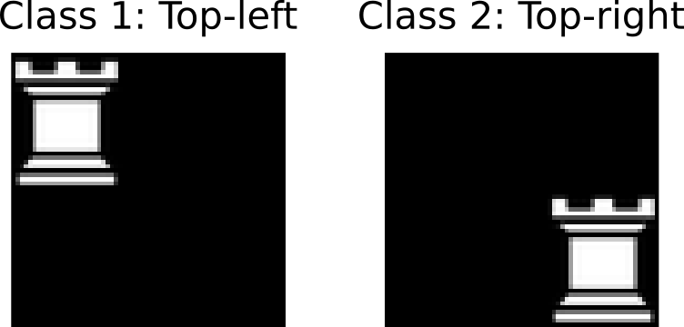
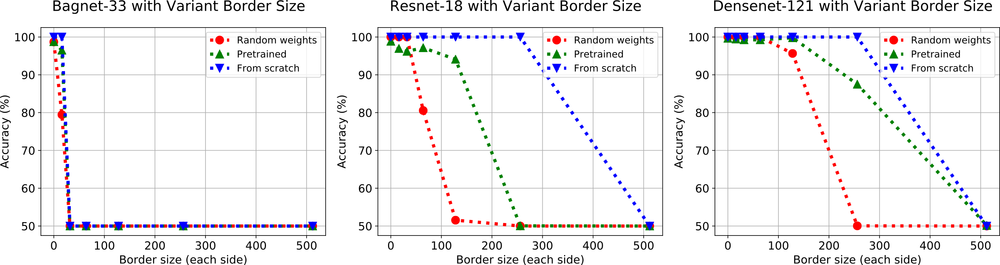
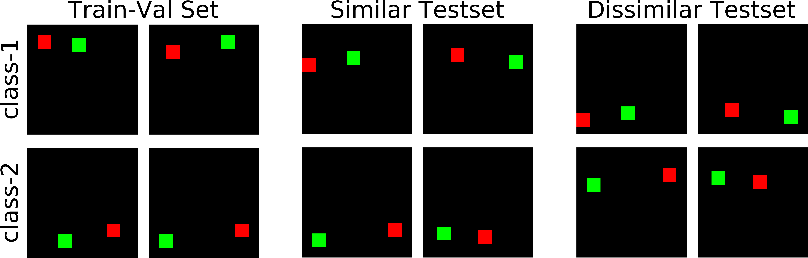
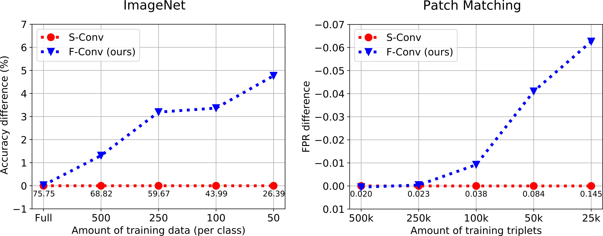
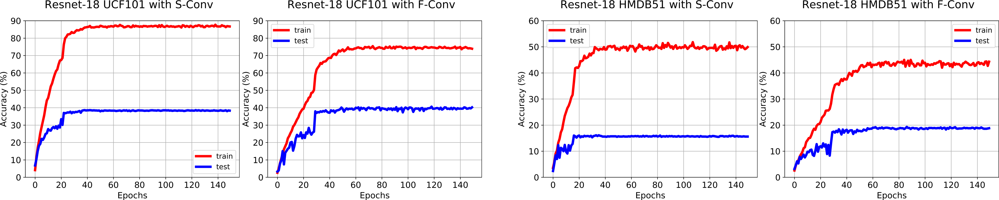

# On Translation Invariance in CNNs: Convolutional Layers can Exploit Absolute Spatial Location 

In [CVPR, 2020](https://arxiv.org/abs/2003.07064).
[Osman Semih Kayhan](https://oskyhn.github.io/) and [Jan van Gemert](http://jvgemert.github.io/index.html). 

You can find [the core](https://medium.com/@oskyhn_77789/current-convolutional-neural-networks-are-not-translation-equivariant-2f04bb9062e3) of the paper and the detailed explanation of [the experiments](https://medium.com/@oskyhn_77789/full-convolution-experiments-with-details-5a795971ffd3) in our blog.

This repository contains the experiments of the paper.  

**Table of contents** 
1. [How far from the image boundary can absolute location be exploited?](#1-How-far-from-the-image-boundary-can-absolute-location-be-exploited-?) 
2. [Border handling variants](#2-Border-handling-variants), with [Red and Green](full_conv/Exp2_Red_Green) experiments 
3. [Sensitivity to image shifts](#3-Sensitivity-to-image-shifts) for [image classification](full_conv/Exp3_image_shifts) 
4. [Data efficiency](#4-Data-efficiency) with [Imagenet Experiment](full_conv/Exp4_data_efficiency/imagenet_classification) and [Patch Matching Experiment](full_conv/Exp4_data_efficiency/patch_matching) 
5. [Small datasets](#5-Small-datasets) with [Action Recognition](full_conv/Exp5_small_datasets/action_recognition)  

## Getting started

For clarity, we put each experiment under a specific folder. 

### PyTorch
We used pytorch for all the experiments in the paper.

- Install PyTorch ([pytorch.org](http://pytorch.org))

## 1. How far from the image boundary can absolute location be exploited?

We have different demostrations of the fact: 

### Can fully convolutional net (FCN) predict location? 
We use a simple patch which is placed on the top-left and bottom-right of the image. We train 5x5 filter with zero padded same convolution followed by ReLU, global max pooling and softmax classifier by using SGD optimizer.

The answer is **YES!** FCN can predict the location. You can try it by using the [notebook](full_conv/Exp1_image_boundary/chess.ipynb).

### Can imagenet pretrained FCN predict location? 

We demonstrate the fact by using Imagenet pretrained weights, training from stratch with randomly initiliazed weights and using randomly initiliazed frozen weights on BagNet-33, Resnet-18 and DenseNet-121 methods. You can see the results below: 

The experiment folder is [here](full_conv/Exp1_image_boundary).

## 2. Border handling variants

We evaluate convolution types in terms of border handling. We generate the Red-Green two class classification dataset (image below) for evaluating exploitation of absolute position. The upper row of images is class 1: Red-to-the-left-of-Green. The lower row of images is class 2: Green-to-the-left-of-Red. The Similar Testset is matching the Train-Val set in absolute location: Class 1 at the top and class 2 at the bottom. The Dissimilar testset is an exact copy of the Similar testset where absolute location is swapped between classes: Class 1 at the bottom, Class 2 at the top. If absolute location plays no role then classification on the Similar Testset would perform equal to the Dissimilar Testset. For each convolution type, the network has 4 convolution layers followed by global max pooling and softmax classifier.

We show below the results of different convolution types on Red and Green dataset: 

| Type   	|  Pad 	| Similar Test 	| Dissimilar Test 	|
|--------	|:----:	|:------------:	|:---------------:	|
| V-Conv 	|   -  	| **100.0±0.0**  |     0.2±0.1     	|
| S-Conv 	| Zero 	|   99.8±0.1   	|     8.4±0.7     	|
| S-Conv 	|  Cir 	|   73.7±1.0   	|     73.7±1.0    	|
| F-Conv 	| Zero 	|   89.7±0.5   	|    **89.7±0.5**    |

*Valid* and *same-zero* exploit location and do poorly on the Dissimilar test set. *Same-circ* is translation invariant yet invents disturbing new content. *Full-zero* is translation invariant, doing well on both test sets.

The experiment folder is [here](full_conv/Exp2_Red_Green).

## 3. Sensitivity to image shifts

By using [Imagenet-A dataset](https://arxiv.org/abs/1907.07174), we compare 4 different methods in terms of diagonal shifting and consistency on 4 ResNet architectures. 

| Diagonal Shift 	| S-Conv 	| F-Conv 	| S+BlurPool 	| F+BlurPool 	|
|----------------	|:------:	|:------:	|:----------:	|:----------:	|
| RN18           	|  79.43 	|  82.74 	|    81.96   	|  **83.95** 	|
| RN34           	|  82.06 	|  85.66 	|    83.73   	|  **86.91** 	|
| RN50           	|  86.36 	|  87.92 	|    87.50   	|  **88.93** 	|
| RN101          	|  86.95 	|  87.78 	|    88.22   	|  **88.73** 	|

| Consistency 	| S-Conv 	| F-Conv 	| S+BlurPool 	| F+BlurPool 	|
|-------------	|:------:	|:------:	|:----------:	|:----------:	|
| RN18        	|  86.43 	|  88.38 	|    88.32   	|  **90.03** 	|
| RN34        	|  87.62 	|  90.12 	|    89.21   	|  **91.53** 	|
| RN50        	|  90.21 	|  91.36 	|    91.68   	|  **92.75** 	|
| RN101       	|  90.76 	|  91.71 	|    92.36   	|  **92.86** 	|

The experiment folder is [here](full_conv/Exp3_image_shifts).

## 4. Data efficiency

###  Image classification
The experiment is done by using [Imagenet-2012 dataset](http://www.image-net.org/challenges/LSVRC/2012/) with [Resnet-50](https://arxiv.org/abs/1512.03385) architecture.

The experiment folder is [here](full_conv/Exp4_data_efficiency/imagenet_classification).

###  Patch matching
The experiment is done on [Brown dataset](http://matthewalunbrown.com/papers/ijcv2007.pdf) by using [Hardnet](https://arxiv.org/abs/1705.10872).

The experiment folder is [here](full_conv/Exp4_data_efficiency/patch_matching).

## 5. Small datasets

###  Action recognition

| **UCF101** 	| S-Conv 	|  F-Conv  	|  F-Conv - Temporal  |
|------------	|:------:	|:--------:	|:--------:	|
| RN-18      	|  38.6  	| **40.6** 	|**42.2** |
| RN-34      	|  37.0  	| **46.9** 	| - 	|
| RN-50      	|  36.2  	| **44.1** 	| -	|

| **HMDB51** 	| S-Conv 	|  F-Conv  	|
|------------	|:------:	|:--------:	|
| RN-18      	|  16.1  	| **19.3** 	|
| RN-34      	|  15.2  	| **18.3** 	|
| RN-50      	|  14.3  	| **19.0** 	|

The experiment folder is [here](full_conv/Exp5_small_datasets/action_recognition).

